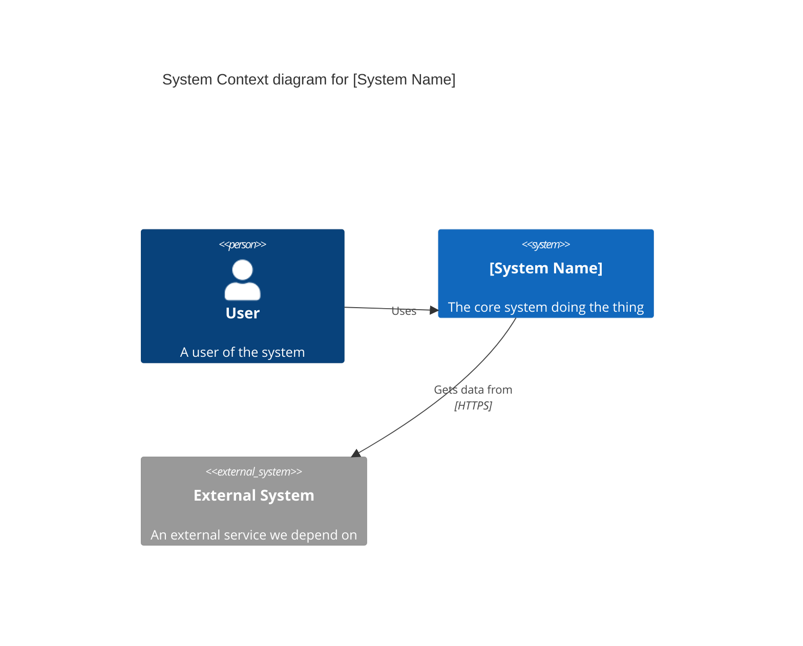
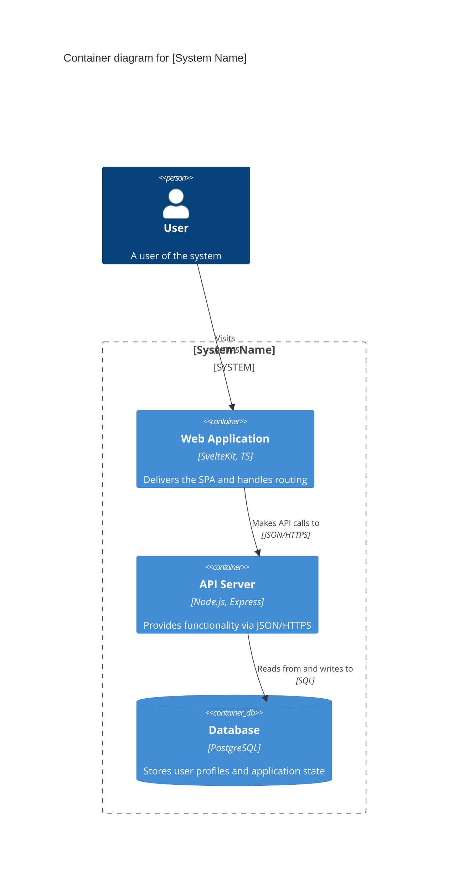
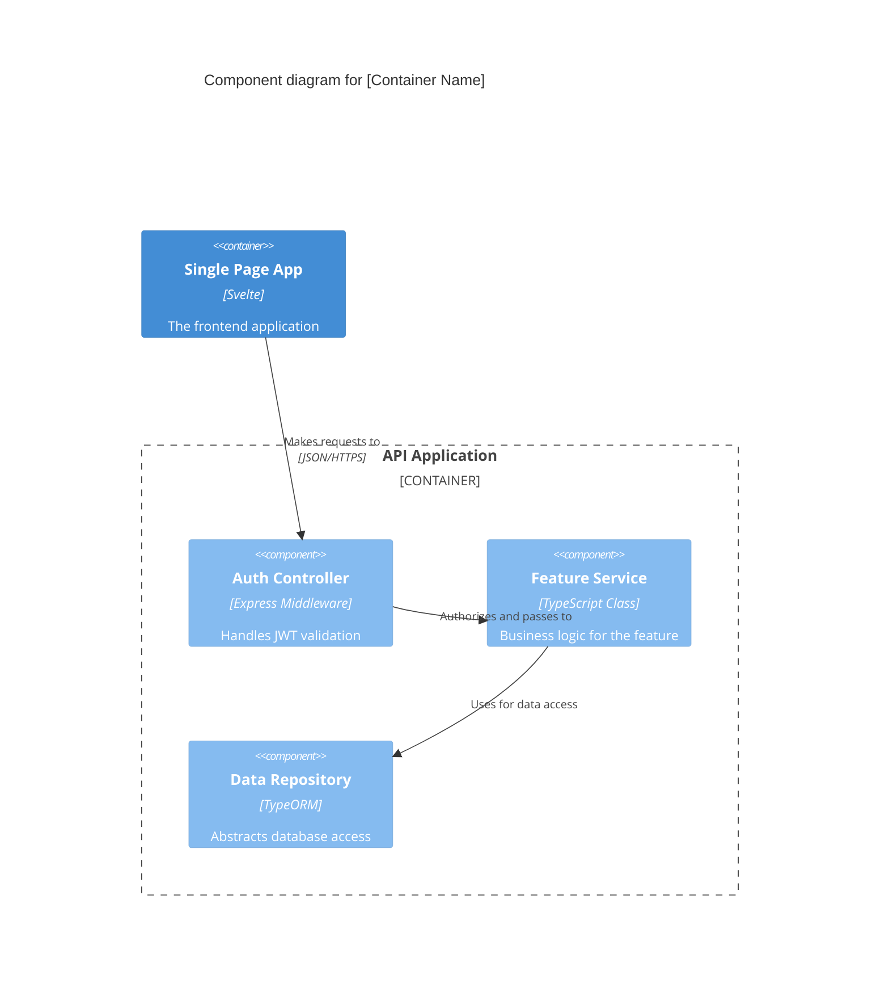
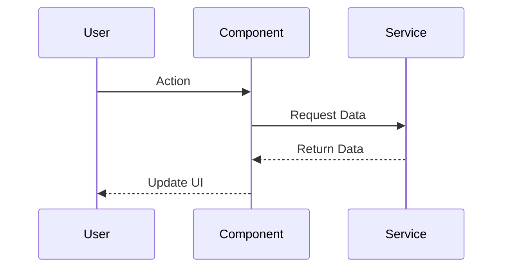

# C4 Architecture Model Template

*Based on Simon Brown's C4 Model for Visualizing Software Architecture. Use Mermaid.js for diagrams.*

## 1. System Context (Level 1)
**Purpose**: Shows the software system you are building and how it fits into the world in terms of the people who use it and the other software systems it interacts with.

## 2. Container (Level 2)
**Purpose**: Zooms into the software system, showing the high-level technical building blocks (containers) and how they interact. A "container" is a web application, mobile app, database, file system, etc.

## 3. Component (Level 3)
**Purpose**: Zooms into an individual container to show the components inside it.

## 4. Code / Data flow (Level 4 - Optional)
**Purpose**: Zooms into an individual component to show how it works (e.g., Sequence diagrams, class diagrams, state machines).

