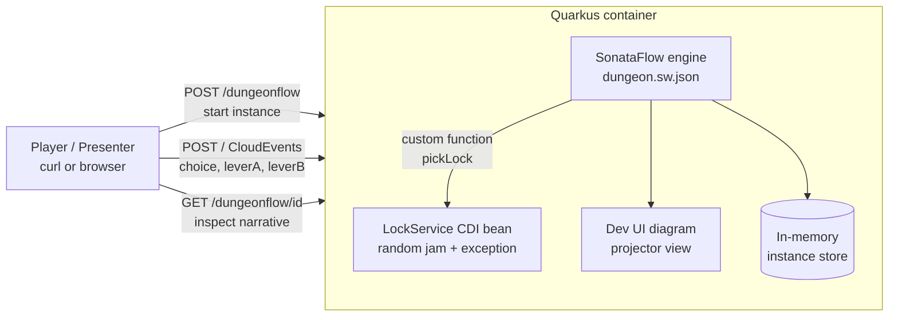

# **Dungeon Flow**

## **AI Solutions Software Requirements Specification**

**Version:** 0.1

**Prepared by:** Fady (FDE) — drafted with Claude

**Organization:** DataRobot — Field Delivery Engineering

**Date Modified:** 2026-08-10

This document defines the *how* of the solution. Strategic context, user journeys, and feature priorities are owned by the companion PRD (`docs/PRD_Dungeon_Flow.md`, v0.1) and referenced here rather than duplicated.

---

## **Completeness Scorecard**

| Section | Status | Confidence | Notes |
| :---- | :---- | :---- | :---- |
| 1. Business Needs | Complete | High | Sourced from PRD v0.1 §1, §3 |
| 2. Solution | Complete | High | Scoped to Crawl phase |
| 3. Stakeholders | Complete | Medium | Single-owner internal project; several roles collapse onto one person |
| 4. The Plan | Complete | Medium | Dates are estimates for a side/enablement project |
| 5. Product Scope & Context | Complete | High | |
| 6. Product Functions & Users | Complete | High | |
| 7. Technical Architecture & Design | Complete | High | |
| 8.1–8.5 Requirements | Complete | High | |
| 8.6 AI/ML Requirements | Partial | Medium | AI applies only to the optional Run-phase boss fight ([PRD-FEAT-14]); specified at outline level |

---

## **Part I: Strategic Alignment (The "What" and "Why")**

### **1. Business Needs**

**Source:** PRD v0.1, Sections 1 and 3. Workflow-engine primitives (event states, switches, joins, retries, timeouts) are abstract and poorly retained from documentation; standard demos don't engage mixed audiences. The gap: onboarding to a workflow engine takes days of reading before productive use, and orchestration demo segments generate low audience interaction. Dungeon Flow closes this by making every primitive a game mechanic that is played, watched, and remembered.

| Business Need | Measurable Impact | Confirmed By |
| :---- | :---- | :---- |
| Hands-on, self-serve asset for learning workflow orchestration | Reduce time-to-first-productive-use of a workflow engine from days of reading to under an hour of play | Fady (FDE manager, product owner) |
| Reusable, reliable live-demo asset for enablement sessions | One-command startup; demo runs identically on any machine via container | Fady (FDE manager, product owner) |

### **2. Solution**

**Solution description:**

A Quarkus application embedding a SonataFlow (Serverless Workflow) engine, whose single workflow definition (`dungeon.sw.json`) encodes a 5-room dungeon. Each player session is one workflow instance; every player move is a CloudEvent delivered over HTTP; game narrative travels in workflow data. One small CDI bean (`LockService`) provides the randomized failure that exercises the retry/error path. The whole game ships as one container image, directly addressing both business needs in Section 1 (self-serve learning, reliable demos).

**Definition of Done (Crawl phase):**

- [ ] A player can start an instance and reach the Treasure Room end state using only curl
- [ ] Left path enforces the two-lever join: gate never opens on one lever alone
- [ ] Trap Corridor demonstrably retries up to 3 times and respawns to the fork on exhaustion
- [ ] Idling past the torch timeout at the fork demonstrably respawns the player at the Entrance
- [ ] The workflow diagram is viewable in the Quarkus Dev UI while an instance progresses
- [ ] `docs/`, workflow, and Java source live in the repo with the README play-guide verified end-to-end

### **3. Stakeholders**

| Role | Description | People |
| :---- | :---- | :---- |
| **Champion** | Drives success on the business side | Fady (FDE manager) |
| **Sponsor(s)** | Influence stakeholders, secure resources | Fady (self-sponsored enablement asset) |
| **End-users** | Directly affected in daily work | FDE team members (learners, presenters, facilitators) |
| **Execution Team** | Implements the change | Fady + Claude (Cowork session) |
| **Consultants** | Specialized input | TBD — none required for Crawl |
| **Approvers** | Formally approve | Fady |
| **DRI** | Accountable for delivery | Fady |

### **4. The Plan**

| Milestone | Target Date | Owner | Dependencies |
| :---- | :---- | :---- | :---- |
| M1 — Scaffold Quarkus/SonataFlow project; workflow + LockService compile and deploy in dev mode | Week 1 | Fady | Platform version pinned (PRD §7 Q2) |
| M2 — Crawl DoD met: full playthrough via curl incl. join, retry, timeout paths; Dev UI diagram verified | Week 1–2 | Fady | M1 |
| M3 — Walk: container image build + minimal HTML front end + 2-player race verified | Week 3 | Fady | M2 |

**Cost & Level of Effort:**

| Field | Value |
| :---- | :---- |
| Estimated effort (person-hours or sprints) | ~2–4 focused sessions (Crawl); +1–2 sessions (Walk) |
| Cost range | Internal time only |
| Pricing model | N/A — internal enablement asset |
| Budget approved? | Yes (self-directed) |

---

## **Part II: Software Requirements Specification (The "How")**

### **5. Product Scope & Context**

**Product name & version:** Dungeon Flow v0.1

**Purpose and capabilities:**

Dungeon Flow is a self-contained, event-driven text-adventure game used as a workflow-orchestration teaching and demo asset. It exposes an HTTP API to start game sessions (workflow instances), accept player moves (CloudEvents), and inspect session state, while the embedded workflow engine enforces the game rules declaratively.

**Ecosystem context:**

This is a new, standalone system with no upstream or downstream integrations; it is intentionally an island so that it runs anywhere a container runs. Operationally it is owned by the FDE team as an enablement asset — no SLAs, no production traffic, no persistent data of value. The workflow engine and its Dev UI are the only "adjacent systems," and both ship inside the same process.

**In scope:**

- 5-room dungeon workflow definition exercising event wait, switch, join, retry/error, and timeout constructs
- HTTP API for start / move / inspect, per the SonataFlow-generated endpoints
- Randomized lock service driving the retry path
- Container image packaging
- (Walk) Minimal single-page HTML front end; (Run) correlation-based player identity and optional LLM boss room

**Out of scope:**

- Persistence of game history across restarts (in-memory instances are acceptable)
- Authentication/authorization (trusted internal demo environments only)
- Production-grade observability, HA, or scaling
- Leaderboards, scores, or any state beyond the workflow instances themselves

### **6. Product Functions & Users**

#### **6.1 Product Functions**

**Game engine**
- Provides a declaratively defined 5-room dungeon whose rules are enforced entirely by the workflow engine
- Enables players to start isolated game sessions and progress via HTTP events
- Automates failure gameplay: random lock jams, bounded retries, respawn compensation, idle timeout

**Inspection & demo**
- Provides per-instance state inspection returning the current narrative
- Provides a live diagram view of the workflow (Dev UI) for projector demos

**Operations**
- Enables listing and cleanup of instances between workshop groups
- Provides a one-command container build and run

#### **6.2 User Characteristics**

**Player / Learner** — engineer or mixed-technical participant; comfortable with curl or a browser; uses the game a handful of times during onboarding or a workshop; needs zero setup and self-explanatory narrative/hints in responses. *(Maps to PRD Core Job 1; [PRD-CUJ-01].)*

**Presenter** — FDE/SA running enablement or customer demos; technically strong; uses the asset repeatedly; needs deterministic startup, a projector-friendly diagram, and reliable ways to trigger each primitive on cue. *(Maps to PRD Core Job 2; [PRD-CUJ-02].)*

**Facilitator / Operator** — runs multiplayer sessions; needs simple instance list/cleanup operations; low tolerance for per-player setup friction. *(Maps to PRD Core Job 3; [PRD-CUJ-03].)*

#### **6.3 Assumptions and Dependencies**

| Type | Description | Impact if False |
| :---- | :---- | :---- |
| Assumption | SonataFlow event states support `exclusive: false` multi-event join in the pinned version | Two-lever puzzle must be remodeled as parallel/callback states — moderate rework of the workflow file |
| Assumption | Event routing via instance reference (`kogitoprocrefid` or equivalent) works in the pinned version | Must implement correlation-based routing earlier than planned (pull Run-phase work into Crawl) |
| Assumption | In-memory instances are acceptable (no persistence addon needed) | Add the persistence addon (e.g., PostgreSQL) — packaging and setup complexity grows |
| Dependency | Quarkus + SonataFlow platform artifacts available from Maven Central | Blocked scaffold; pin to a known-good platform BOM |
| Dependency | Java 17+ and a container runtime on target machines | Demo machines must be pre-provisioned; document prerequisites in README |

### **7. Technical Architecture & Design**

#### **7.1 High-Level Architecture & Diagram**

**Core Components:**

* **Frontend:** None in Crawl (curl). Walk phase adds a single static HTML page served by Quarkus that polls instance state and posts CloudEvents.
* **Application Backend:** Quarkus app hosting the SonataFlow engine; SonataFlow auto-generates the REST endpoints for instance start/inspect and the CloudEvents HTTP ingress for moves.
* **AI Agents / Middleware:** None in Crawl/Walk. Run phase optionally adds one LLM call inside a boss-fight state (see 8.6).
* **Database / Storage:** In-memory workflow instance store (engine default). No external database.

#### **7.2 Technology Stack**

| Component | Technology / Platform / Tool |
| :---- | :---- |
| **AI Platform** | N/A (Run phase only: DataRobot LLM Gateway or direct provider — TBD) |
| **LLM(s)** | N/A in Crawl/Walk; TBD for [PRD-FEAT-14] |
| **Frontend** | None (Crawl); static HTML + vanilla JS served by Quarkus (Walk) |
| **Application Backend** | Java 17+, Quarkus, SonataFlow (Serverless Workflow 0.8), extensions: `sonataflow-quarkus`, `sonataflow-quarkus-devui`, `kie-addons-quarkus-source-files` |
| **Databases** | None — in-memory instance store |
| **OCR / Parsing** | N/A |
| **Core Libraries** | CloudEvents (HTTP binding, bundled), Maven, `quarkus-container-image-jib` (Walk) |

### **8. Requirements**

Organization: by use case (workflow-tool project). Every requirement traces to a PRD feature row.

#### **8.1 External Interfaces**

**8.1.1 User Interfaces**

Crawl: not applicable — interaction is via HTTP API only; narrative text and a `hint` field in responses are the "UI." Walk ([PRD-FEAT-13]): one static page — narrative panel, buttons for left/right/lever A/lever B, current-room indicator; no accessibility/localization requirements beyond readable defaults (internal asset).

**8.1.2 Software Interfaces**

| Interface | Direction | Protocol / Format | Notes |
| :---- | :---- | :---- | :---- |
| `POST /dungeonflow` | Inbound | HTTP, JSON | Start instance; returns instance id + Entrance narrative. Auto-generated by SonataFlow |
| `POST /` (event ingress) | Inbound | HTTP, CloudEvents JSON (`application/cloudevents+json`) | Move events: types `game.choice`, `game.lever.a`, `game.lever.b`; routed by instance reference (Crawl) |
| `GET /dungeonflow/{id}` | Inbound | HTTP, JSON | Inspect instance `workflowdata` (narrative); 404 after completion |
| Dev UI | Inbound (browser) | HTTP | Workflow diagram + instance view; dev/demo profile only |

Error/timeout handling: unknown instance references return 404; malformed CloudEvents return 4xx from the engine; the workflow's own timeout semantics are functional requirements (REQ-FUNC-005).

#### **8.2 Functional Requirements**

**Game session lifecycle**

| Field | Value |
| :---- | :---- |
| **ID** | REQ-FUNC-001 |
| **Title** | Start game instance |
| **Statement** | The system shall create a new, isolated workflow instance on `POST /dungeonflow` and return the instance id and the Entrance narrative in the response body. |
| **Rationale** | Entry point for all journeys. Supports: [PRD-FEAT-02], [PRD-CUJ-01] |
| **Acceptance Criteria** | POST with `{}` returns 2xx, a non-empty `id`, and `workflowdata.narrative` containing the Entrance text; two POSTs yield two distinct ids whose subsequent moves do not affect each other. |
| **Priority** | Must |
| **Verification Method** | Test |
| **Related Artifacts** | `dungeon.sw.json` (Entrance state) |

| Field | Value |
| :---- | :---- |
| **ID** | REQ-FUNC-002 |
| **Title** | Choice routing (switch) |
| **Statement** | The system shall hold an instance in the ForkRoom until a `game.choice` CloudEvent addressed to that instance arrives, then route to the Lever Room on `choice=="left"`, to the Trap Corridor on `choice=="right"`. |
| **Rationale** | Demonstrates event wait + data-based switch. Supports: [PRD-FEAT-03], [PRD-CUJ-01] |
| **Acceptance Criteria** | Instance state does not advance before the event; "left" verifiably lands in LeverRoom and "right" in TrapCorridor (observable via Dev UI or state inspection); an unrecognized choice value routes to the TorchOut/respawn path (default condition). |
| **Priority** | Must |
| **Verification Method** | Test |
| **Related Artifacts** | `dungeon.sw.json` (ForkRoom, WhichWay states) |

| Field | Value |
| :---- | :---- |
| **ID** | REQ-FUNC-003 |
| **Title** | Two-lever join |
| **Statement** | The system shall advance an instance out of the Lever Room only after **both** `game.lever.a` and `game.lever.b` events have been received for that instance, in any order. |
| **Rationale** | Demonstrates multi-event join semantics. Supports: [PRD-FEAT-04], [PRD-CUJ-01] |
| **Acceptance Criteria** | After only lever A (or only B), the instance remains in LeverRoom; after both, it advances to TrapCorridor; order A→B and B→A both succeed. |
| **Priority** | Must |
| **Verification Method** | Test |
| **Related Artifacts** | `dungeon.sw.json` (LeverRoom, `exclusive: false`) |

| Field | Value |
| :---- | :---- |
| **ID** | REQ-FUNC-004 |
| **Title** | Trap Corridor retry and respawn |
| **Statement** | The system shall invoke the lock-pick function in the Trap Corridor, retrying on `LockJammed` errors up to 3 attempts with a fixed delay; on retry exhaustion it shall transition the instance to the Respawn state and return the player to the ForkRoom with an explanatory narrative. |
| **Rationale** | Demonstrates retries + error compensation. Supports: [PRD-FEAT-05], [PRD-CUJ-01] |
| **Acceptance Criteria** | With the lock service forced to always fail, exactly 3 attempts are observable in logs and the instance lands back in ForkRoom with the respawn narrative; with the service forced to always succeed, the instance proceeds to TreasureRoom. |
| **Priority** | Must |
| **Verification Method** | Test |
| **Related Artifacts** | `LockService.java`, `dungeon.sw.json` (TrapCorridor, Respawn, retries) |

| Field | Value |
| :---- | :---- |
| **ID** | REQ-FUNC-005 |
| **Title** | Torch timeout |
| **Statement** | The system shall, if no `game.choice` event arrives within 60 seconds of an instance entering the ForkRoom, fire the event timeout and route the instance to the TorchOut narrative and back to the Entrance. |
| **Rationale** | Demonstrates event timeouts. Supports: [PRD-FEAT-06], [PRD-CUJ-01], [PRD-CUJ-02] |
| **Acceptance Criteria** | An instance left idle 60s+ at the fork is observed transitioning through TorchOut to Entrance without any player input; a choice sent at 59s still routes normally. |
| **Priority** | Should |
| **Verification Method** | Test |
| **Related Artifacts** | `dungeon.sw.json` (ForkRoom `timeouts.eventTimeout`, TorchOut) |

| Field | Value |
| :---- | :---- |
| **ID** | REQ-FUNC-006 |
| **Title** | Victory and completion |
| **Statement** | The system shall, upon an instance reaching the Treasure Room, deliver the victory narrative in the instance data and complete (end) the workflow instance. |
| **Rationale** | Defines the success state of the game. Supports: [PRD-FEAT-01], [PRD-CUJ-01], [PRD-CUJ-03] |
| **Acceptance Criteria** | The final state's data contains `victory: true` and the victory narrative; after completion the instance is reported completed/absent by the inspection endpoint. |
| **Priority** | Must |
| **Verification Method** | Test |
| **Related Artifacts** | `dungeon.sw.json` (TreasureRoom, `end: true`) |

**Inspection & operations**

| Field | Value |
| :---- | :---- |
| **ID** | REQ-FUNC-007 |
| **Title** | Instance state inspection |
| **Statement** | The system shall return the current `workflowdata` (including the latest narrative) for a given active instance id, and a not-found/completed signal for finished instances. |
| **Rationale** | Players check their fate; facilitators track the race. Supports: [PRD-FEAT-07], [PRD-FEAT-12], [PRD-CUJ-03] |
| **Acceptance Criteria** | GET on an active instance returns its narrative; GET on a completed instance returns 404 (documented in README as the victory signal). |
| **Priority** | Should |
| **Verification Method** | Test |
| **Related Artifacts** | SonataFlow generated endpoints |

| Field | Value |
| :---- | :---- |
| **ID** | REQ-FUNC-008 |
| **Title** | Concurrent isolated sessions |
| **Statement** | The system shall support at least 10 concurrent active instances with full event isolation — an event addressed to one instance shall never advance another. |
| **Rationale** | Multiplayer race on one container. Supports: [PRD-FEAT-11], [PRD-CUJ-03] |
| **Acceptance Criteria** | With 10 instances at the fork, one choice event advances only its addressed instance; a scripted 10-player race completes with 10 independent outcomes. |
| **Priority** | Should |
| **Verification Method** | Test |
| **Related Artifacts** | Event routing config |

**Packaging**

| Field | Value |
| :---- | :---- |
| **ID** | REQ-FUNC-009 |
| **Title** | Container packaging |
| **Statement** | The system shall build into a single OCI container image via the standard Quarkus container-image build, and the full game (REQ-FUNC-001…008) shall be playable against the running container on port 8080. |
| **Rationale** | One-command demos anywhere. Supports: [PRD-FEAT-08], [PRD-CUJ-02] |
| **Acceptance Criteria** | `mvnw package -Dquarkus.container-image.build=true` produces an image; `docker run -p 8080:8080 …` serves a complete playthrough. |
| **Priority** | Must |
| **Verification Method** | Demonstration |
| **Related Artifacts** | `pom.xml`, README |

#### **8.3 Quality of Service**

**8.3.1 Performance** — No hard targets (internal demo). Guidance: move-event to state-transition visible in ≤2s on a laptop so demos feel live. Verification: informal measurement during M2.

**8.3.2 Availability** — Not applicable; runs on demand for sessions. No RTO/RPO: instance loss on restart is acceptable and documented.

**8.3.3 Scalability** — Bounded by REQ-FUNC-008 (≥10 concurrent instances). No horizontal scaling; single container by design.

**8.3.4 Security** — No authn/authz (trusted internal networks/laptops only); the app shall not be exposed on public networks (constraint C-4). No sensitive data is processed or stored.

**8.3.5 Reliability** — Retry behavior is itself a functional feature (REQ-FUNC-004). Event delivery is at-most-once from the player's perspective; the README shall instruct players to re-send a move if state doesn't advance.

**8.3.6 Observability** — Console logging of room narrations and lock attempts is sufficient (it is part of the demo experience). Dev UI provides instance visibility. No metrics/tracing/alerting.

#### **8.4 Compliance**

Not applicable — internal enablement asset; no personal, customer, or regulated data. If the asset is later reused customer-facing (PRD Appendix B #2), re-review under DataRobot demo-asset guidelines.

#### **8.5 Constraints**

- C-1: The dungeon logic **must** live entirely in the Serverless Workflow definition; Java code must not encode room-to-room game rules (the "workflow IS the map" premise).
- C-2: The stack **must** be Quarkus + SonataFlow with a pinned platform BOM version (resolves PRD §7 Q2 at scaffold time).
- C-3: The deliverable **must** run as a single container with no external services (no DB, no broker) in Crawl/Walk.
- C-4: The application **must not** be deployed on publicly reachable networks (no auth exists).
- C-5: Repository layout **must** keep specs in `docs/`, workflow in `src/main/resources/`, and services under `org.acme.dungeon` (or the package chosen at scaffold), matching this SRS's Related Artifacts references.

#### **8.6 AI/ML Requirements**

Applies **only** to the optional Run-phase boss fight ([PRD-FEAT-14]); all other gameplay is deterministic/random without AI. Outline-level until the Run phase is committed:

**8.6.1 Model & Architecture**

| Field | Value |
| :---- | :---- |
| Model provider | TBD — DataRobot LLM Gateway preferred for internal use |
| Model family / version | TBD |
| Selection rationale | Low-stakes single-turn riddle refereeing; smallest/cheapest adequate model |
| Prompt strategy | Zero-shot with a fixed referee system prompt |
| Context window constraints | Trivial (single riddle + single answer per call) |

**8.6.2 Data Requirements** — None; no training or evaluation datasets. Riddles are authored content in the workflow data.

**8.6.3 Performance, Evaluation, & Reproducibility** — Referee call p95 latency ≤5s to keep the game playable; verdicts must be constrained to a structured pass/fail output parsed by the workflow.

**8.6.4 Safety, Bias, & Guardrails** — Referee prompt shall constrain output to the verdict schema; free-form player input shall not be echoed into narratives without the constrained output step.

**8.6.5 Fallback & Degradation**

| Field | Value |
| :---- | :---- |
| **ID** | REQ-AIML-001 |
| **Title** | Deterministic boss-fight fallback |
| **Statement** | The system shall, if the LLM referee call fails or times out, fall back to a deterministic answer check (exact/normalized string match) so the game remains completable offline. |
| **Rationale** | The demo must never depend on external availability. Supports: [PRD-FEAT-14] |
| **Acceptance Criteria** | With outbound network disabled, the boss room is still completable via the deterministic check; the narrative notes the "grumpy offline referee." |
| **Priority** | Must (within Run phase) |
| **Verification Method** | Demonstration |
| **Related Artifacts** | Run-phase boss state (future) |

**8.6.6 Human-in-the-Loop** — Not applicable; no consequential AI decisions.

**8.6.7 Model Lifecycle & Operations** — Not applicable; single stateless inference call, no retraining or monitoring obligations.

---

## **Appendix A: Glossary**

Owned by the PRD — see PRD Appendix A. SRS-specific additions:

| Term | Definition |
| :---- | :---- |
| **SRS** | Software Requirements Specification — this document. |
| **Dev UI** | Quarkus development-mode console; hosts the SonataFlow diagram used as the projector view. |
| **CDI bean** | A managed Java component (Contexts and Dependency Injection); how `LockService` is exposed to the workflow. |
| **BOM** | Bill of Materials — the pinned Quarkus platform version set (constraint C-2). |

## **Appendix B: Data Dictionary**

| Entity / Field | Type | Description | Source | Owner |
| :---- | :---- | :---- | :---- | :---- |
| `workflowdata.narrative` | string | Current room description shown to the player | Workflow inject states | Workflow definition |
| `workflowdata.choice` | string | Player's fork decision ("left"/"right") | `game.choice` event payload | Player |
| `workflowdata.victory` | boolean | Set true in the Treasure Room | Workflow end state | Workflow definition |
| CloudEvent `type` | string | Move type: `game.choice`, `game.lever.a`, `game.lever.b` | Player event | Player |
| Instance reference attribute | string | Routes an event to one instance (Crawl: instance id reference; Run: `playerid` correlation) | Player event envelope | Engine |

## **Appendix C: Open Questions & Discovery Gaps**

| # | Question | Section Affected | Priority | Status | PRD Cross-Ref? |
| :---- | :---- | :---- | :---- | :---- | :---- |
| 1 | Walk front end: poll `GET /dungeonflow/{id}` vs. subscribe to emitted state-change events? Polling is simplest and matches C-3 (no broker) | 7, 8.1 | Low | Open | Yes (PRD Appendix B #1) |
| 2 | Exact event-routing mechanism in the pinned SonataFlow version (`kogitoprocrefid` vs. successor) — verify at M1 | 8.1.2, 6.3 | Medium | Open | Yes (PRD §7 Q1/Q2) |
| 3 | Does the Dev UI diagram render acceptably from a *container* (prod profile), or is dev mode required for the projector view? Affects [PRD-FEAT-09] | 7.1 | Medium | Open | No |
